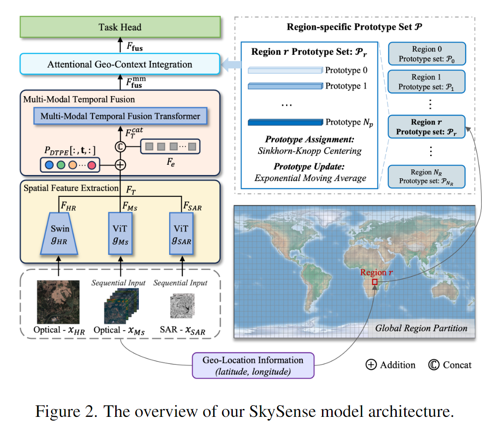
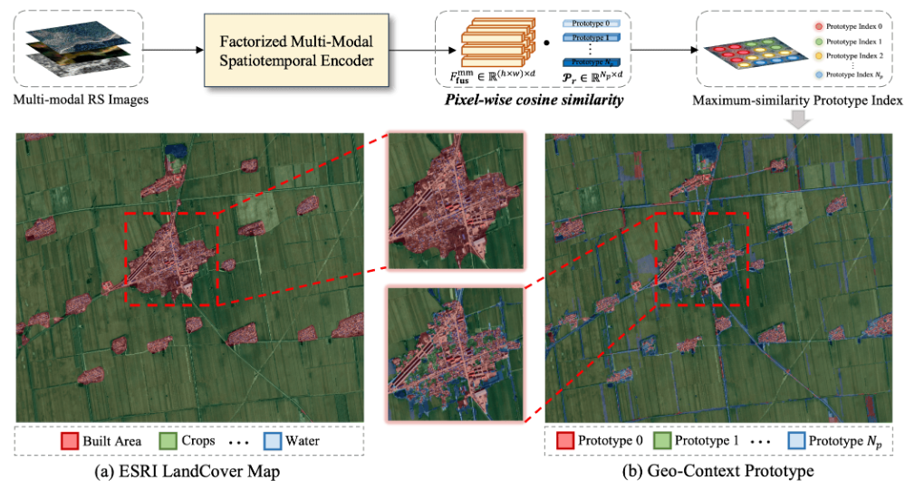
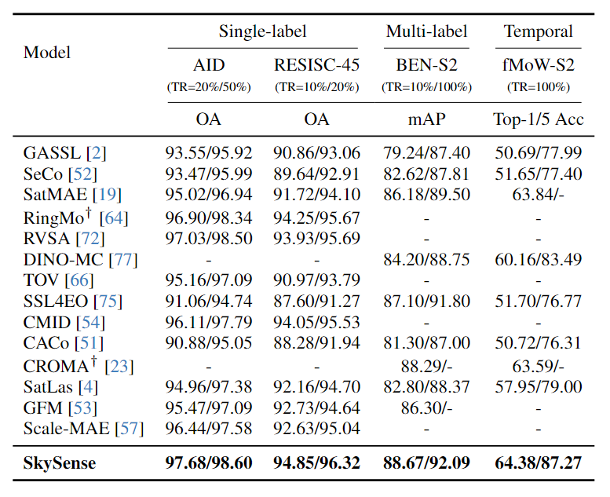

# Skysense

Skysense简单来说，是一个能够处理多模态，在遥感下游任务上表现良好的基模。

他的核心架构如下：

整体结构较为简单，主要分为以下几个部分：

## 因子化多模态时空编码器

说的很玄乎，其实就是编码前对向量的处理

主要做法是，分别利用3个模态的encoder对可见光，多光谱和SAR图像进行编码，然后concat起来，加上时间信息向量（和传统的位置向量有点相似），在头部concat一个cls向量，然后送入encoder得到最终包含时空信息的编码 $F^{mm}_{fus}$。

得到这个 $F^{mm}_{fus}$之后，结合在预训练中得到的一个全球地理特征表（图右侧），进行一个QKV计算，Q是 $F^{mm}_{fus}$，KV是特征表，这样进行与地理特征表中的特征有关的向量生成，再和 $F^{mm}_{fus}$ concat得到最后的 $F_{fus}$。

## 预训练时的设计

首先他们采用的是student-teacher的架构，来最大程度避免RSI的负样本问题

**多粒度对比学习**

这个多粒度就是**像素、目标、图像**这三个粒度

分别计算Loss之后加起来

**多模态对齐**

用了一个multi-modal contrastive loss，来把同一位置的不同模态图片信息对齐

**非监督地理信息原型学习**

这个貌似是创新点。

就是对地球进行了建模，以经度纬度为单位，在小格子里建立多层信息，然后利用$F^{mm}_{fus}$这个语义丰富的向量来训练这个格子，最终让格子里的每一层学习到对应的地理信息，用于辅助下游任务。

## 实验设置

他们的主要对比对象有如下模型：

但是在文中没有写清楚选择标准，同时有一些数据是空缺的，怀疑直接从别人的论文里抄的数据。

这里我就想吐槽一下这些AI的文章。他们的实验设置讲的都是稀烂。没有工具的选择标准，没有一个对比的基线。

基本上，每一个任务里的对比模型都不尽相同，而文章中也没有解释，为什么在前一节能够对比的模型，到了这一节却突然消失了。我大发慈悲地猜测，可能是因为每个模型能做到的任务不同，所以可能对于分类任务能够对比，但是分割任务不能对比。而这种信息不应该让读者去猜，而是应该直接写出来。

这要是高教授来审稿，这里的实验部分肯定是要重写的。
