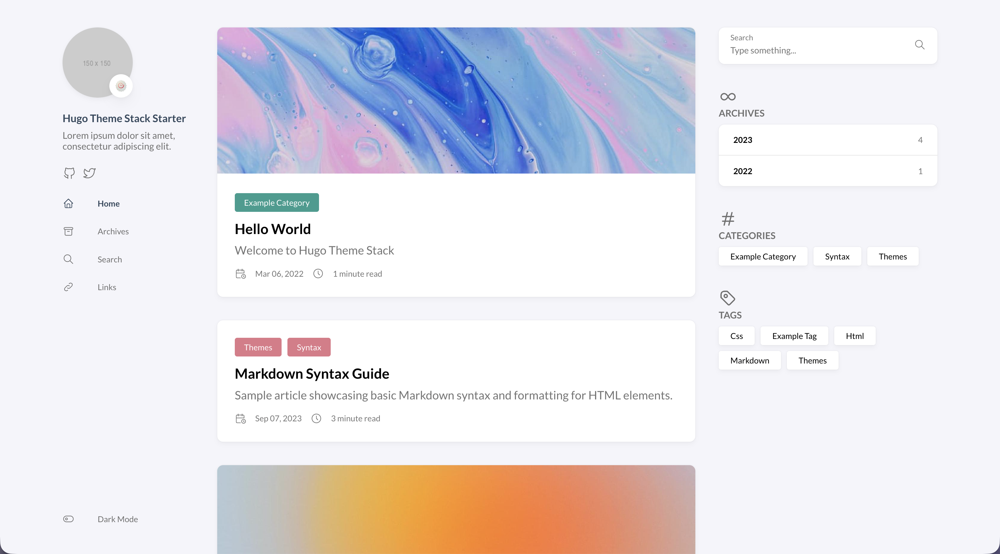
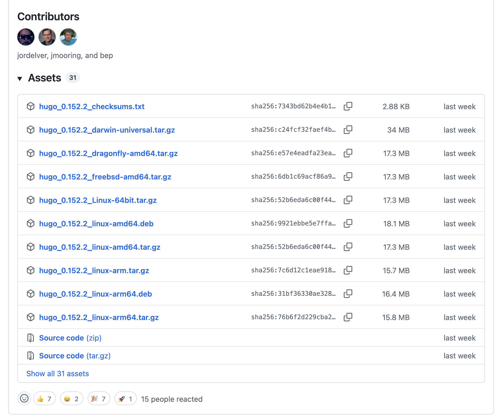
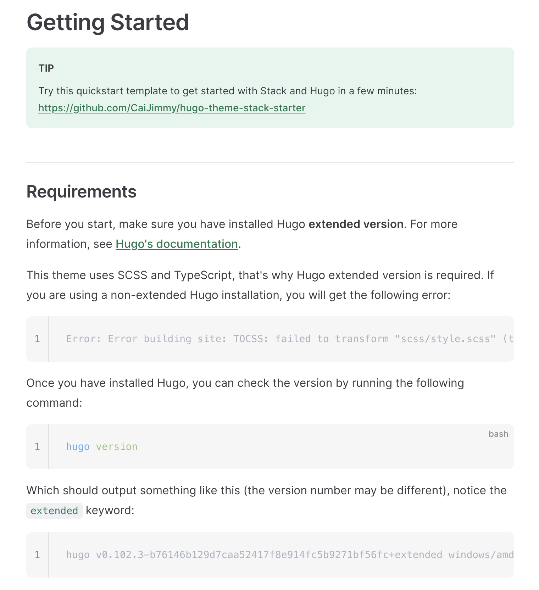

# 终于配好了

终于把这个傻逼stack主题配好了，真是傻逼，真是傻逼。

# 简介

如果在网络上去搜索某些技术文档或者教程，你大概率会找到各种各样开发者自建的博客。这些博客五花八门，多数有着绚丽的鼠标追踪背景，live2d小人，你可以在里面自定义自己的小世界。

笔者近期闲来无事，也就有了想要自己搭建一个博客站的想法。经过简单的了解，最终决定使用 **Hugo** 来搭建。

Hugo是一个开源的静态网站生成器。能够让用户在无代码的环境下快速部署静态网站(当然还是需要有一些命令行和git的基础)。同时Hugo有大量的第三方主题(theme)可供选择，整个社区的十分活跃，教程十分丰富，非常适合作为博客开发的入门框架使用。

当然，我是看中了Hugo的Stack主题，我觉得这个主题还挺好看的，符合了我对于博客站的一切幻想。



接下来就简单介绍一下，我用Hugo和Stack主题来搭建这个博客站的一些踩坑经历。

⚠️**声明： 本人在初期开发过程中参照了bilibili的up主[Letere-莱特雷](https://space.bilibili.com/402971365?spm_id_from=333.337.search-card.all.click)的教程。在其基础上，本人总结了一些在linux环境下搭建的踩坑经验，供各位参考。本人也是正在学习Hugo的相关配置，如果有可以优化的地方，可以在评论里指出。**

叠甲完毕，让我们开始吧！

# 安装Hugo

Hugo整体需要安装`Hugo`, `Go`和`Dart SCSS`，我们一步一步来。

## Hugo

首先的首先，我们需要安装Hugo，这也是整个配置中最关键的一环。

Hugo的版本分为很多种，我们去他的github仓库的[release部分](https://github.com/gohugoio/hugo/releases)就可以看到所有的版本和每一个版本里的所有的类型。

彼时时间为2025年11月2日，以当前最新的0.152.2版本为例，在github上可以安装的发布类型如图所示。



一般来说，我们肯定是下载最新的版本是最好的。**但是！我们使用的Stack主题却对版本有硬性要求！**

> *以下安装教程仅针对需要使用Stack主题的读者参考*

让我们来看一下[Stack的文档](https://stack.jimmycai.com/guide/getting-started)中给出的安装提示。



可以看到，因为Stack主体使用了SCSS和Typescript来开发样式，所以他们需要安装**Hugo extend**环境。而Hugo的最新版是没有extend版本的！

所以不管你是想要使用apt-get安装，还是使用github release安装，还是用官方文档里推荐的snap安装，必须要确保安装的版本和你想使用的theme的要求版本是一致的。

当然，如果要使用stack主题的话，用snap安装是会和scss冲突的，我这里就踩坑了。

所以推荐大家，使用稍旧一点的，带有extend的Hugo安装。

在release界面下载0.152.1的含有extend前缀的版本。根据你自己的操作系统来选择安装。安装过程就不详细说明了，因系统而异。

安装完成，运行命令
```bash
hugo version
```
得到结果
```
hugo v0.152.1-5869cbddd88590563c2b7b400e804ccc7d2cb697+extended linux/amd64 BuildDate=2025-10-22T19:10:44Z VendorInfo=gohugoio
```
带有`extend`字样，那么就OK了。


## Go

接下来是安装Go，这里没有什么坑，直接安装即可。

## Dart SCSS

安装Dart SCSS也相对简单，按照[官方文档](https://sass-lang.com/install/)一步一步来就可以了。

这里要注意，在Hugo的文档里，他说了一句话：

> If you install Hugo as a Snap package there is no need to install Dart Sass. The Hugo Snap package includes Dart Sass.

他说的很有道理，如果你使用snap安装Hugo，就可以省略这一步。

但是，如果你想用Stack主题，则不能用snap安装Hugo，因为snap安装的Hugo没有extend版本。

## Best practice

1. 在github的release上找到extend版本Hugo安装
2. 安装Go
3. 安装Dart SCSS

好的，至此我们的环境搭建完毕了。接下来就是可以搭建博客和配置主题了！

# 配置Stack

接下来的内容，和莱特雷的教程就基本一致了，我也是参考他的配置来使用的Stack主题。这里放上他的视频，读者们可以进行一些参考。

同时关于后期使用github action进行部署，也可以参考[他的博客](https://letere-gzj.github.io/hugo-stack/p/hugo/custom-blog/#3-github%E9%83%A8%E7%BD%B2)，写的很详细，笔者基本沿用了他的方法。




笔者的配置和莱特雷不同的点是，我直接使用了Stack文档中推荐的[git submodule的方式](https://stack.jimmycai.com/guide/getting-started)进行主题安装。

首先，在我们新建的项目在，初始化git仓库，因为我们要进行版本管理和后期在github上使用action进行部署。

紧接着就可以运行
```bash
git submodule add https://github.com/CaiJimmy/hugo-theme-stack/ themes/hugo-theme-stack
```
将Stack主体添加到项目根目录的themes目录下。

这就不用像视频里一样去下载github的zip压缩包了，更加便利。

当然，因为我们使用了git submodule的方式，所以当我们修改了Stack主体的一些内容之后(这是可能的，因为我们可以修改里面的文件自定义样式和功能)，需要fork一份Stack的仓库进行提交，比较麻烦

笔者这里直接把这个仓库的.git配置给删除了，让他变成普通目录，力大砖飞，并不推荐。

根据笔者的观察和理解，当创建了Hugo的项目之后，Hugo会使用配置文件来管理项目，这个配置文件是可以有三种格式的：`toml`,`yaml`,`json`。

我们使用的0.152.1版本给出的默认配置文件是toml格式的，他的名字叫hugo.toml，就在项目的根目录下。

但是Stack主题使用的配置文件叫hugo.yaml。这里就需要你把Stack主题的配置文件复制过来，然后删除原本的toml文件。以后只需要在hugo.yaml文件里进行修改。

# 尾声

至此，整体使用Hugo+Stack的配置踩坑记录就结束了，希望大伙玩得愉快:)


