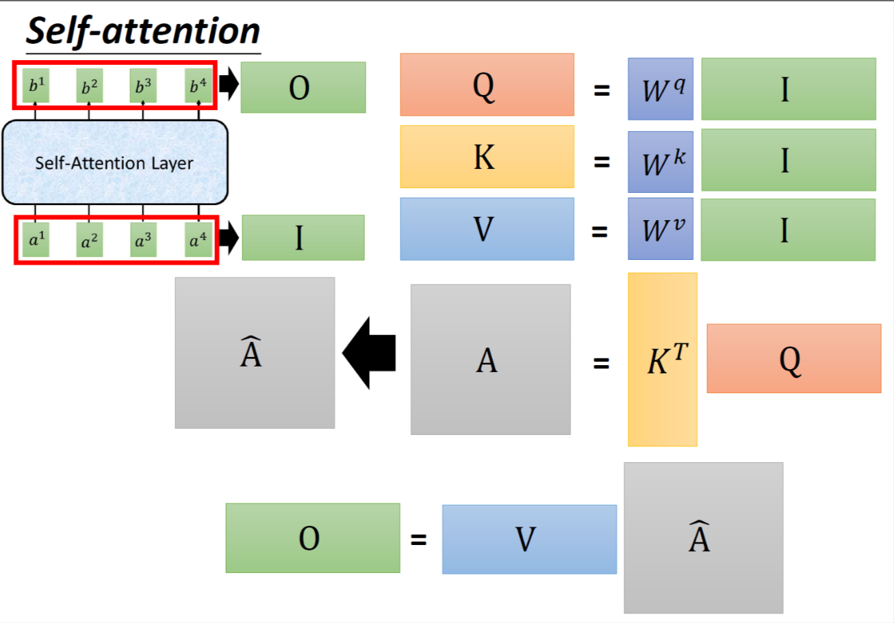
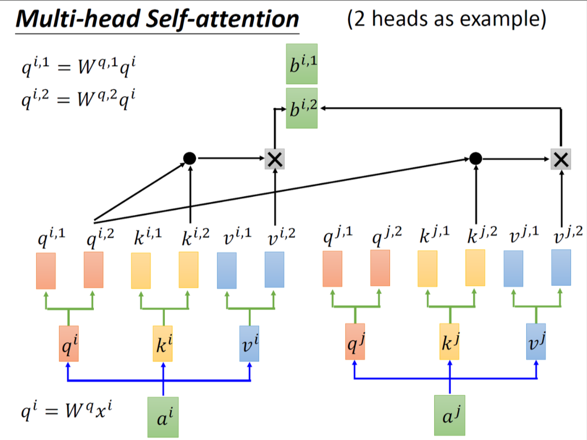
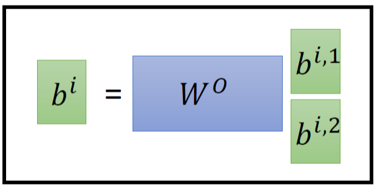
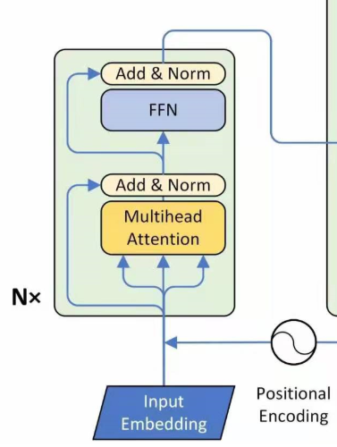
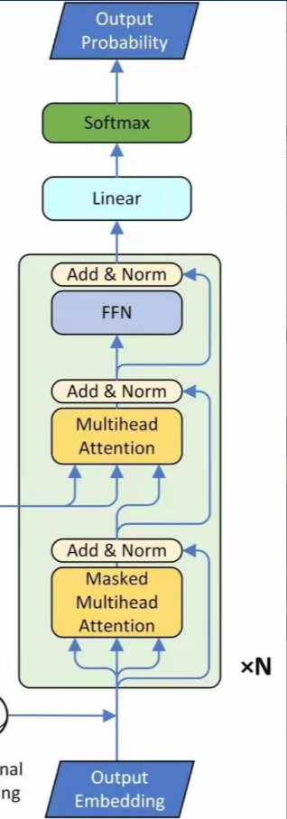

# Transformer学习笔记

本篇笔记记录了笔者在学习transformer架构时的一些心得体会。笔者的学习资料来自[科技猛兽](https://zhuanlan.zhihu.com/p/340149804)的博客。也请大家去阅读原文，原文的介绍更加详细。本文在原文的理解基础上，加入了更详细的代码解读。

transformer整体结构的核心点有以下几点：
- Self-Attention机制
- 多头注意力
- 位置编码

# Self-Attention

注意力是transformer的核心，他的目标是对输入序列进行全局关注，并最终能够并行计算。
> RNN只顺序计算，并且只能考虑之前序列的输入，不能考虑之后的。
> CNN只能考虑一个范围内的输入，内容更加有限

Attention主要由三个部分计算得到：Q(query), K(key), V(value)

就像从字典里查询单词的过程一样，对于一个Q，我们取寻找和他相似的K，然后获取K对应的结果V。

整体的流程如下图：



对于一个输入序列$I = (a^1, a^2, ..., a^n) = W(x^1, x^2, ..., x^n)$, 其中$x^i$是输入的词向量，$W$是词向量编码矩阵，$a^i$是输入序列的权重向量。

> W的代码表示：
> ```python
> # encoder
>   self.src_word_emb = nn.Embedding(n_src_vocab, d_word_vec, padding_idx=pad_idx) 
> ```
> 其中n_src_vocab是源语言的词表大小，d_word_vec是词向量的维度，pad_idx是填充标签\<pad>的索引。对于decoder来说就是n_trg_vocab和d_word_vec。如果源语言和目标语言的编码相似，那么就可以共享参数。

$I$经过三个对应的转化矩阵，将$a^i$转化为$q^i, k^i, v^i$：
$$
q^i = W^qa^i\\ k^i = W^ka^i\\ v^i = W^va^i
$$
现在我们可以做$q$和$k$的attention，具体来说就是计算点积：
$$
Scaled\ Dot{-}Product\ Attetion: \alpha_{i,j} = \frac{q^i \cdot k^j}{\sqrt{d_k}}
$$

其中$d_k$是$k$和$q$的维度，他们是相等的。这么做有一个归一化的效果。

接着我们将所有的$\alpha$进行softmax：

$$
\hat{\alpha_{i,j}} = \frac{\exp(\alpha_{i,j})}{\sum_j \exp(\alpha_{i,j})}
$$

紧接着，我们使用$\hat{\alpha}$和$v$对应相乘来得到$b$,作为最终的输出：

$$
b^i = \sum_j \hat{\alpha_{i,j}}v^j
$$

## 代码实现

在代码中，计算注意力和输出$B$是使用单独模块实现的：

```python
class ScaledDotProductAttention(nn.Module):
    def __init__(self, temperature, attn_dropout=0.1):
        super().__init__()
        self.temperature = temperature # 这里就是d_k
        self.dropout = nn.Dropout(attn_dropout)

    def forward(self, q, k, v, mask=None):

        attn = torch.matmul(q / self.temperature, k.transpose(2, 3)) # 此处为Q·K^T/sqrt(d_k)

        if mask is not None:
            attn = attn.masked_fill(mask == 0, -1e9) # 如果有，加入超大负数作为掩码

        attn = self.dropout(F.softmax(attn, dim=-1)) # softmax操作
        output = torch.matmul(attn, v) # 和所有的v相乘计算得到b

        return output, attn
```

对QKV的计算在多头自注意力模块实现。

# 多头自注意力

所谓多头自注意力，实际上就是将原本的$Q$,$K$,$V$分别拆分成$n\_head$个子矩阵，然后进行$n\_head$次注意力计算，最后将所有的结果进行拼接，得到最终的输出。



对于一个完整的转化矩阵$W^q$，通过变化我们将它拆分为$W^{q,1}, W^{q,2}, ..., W^{q,n\_head}$,在得到$q^i$之后拆分为对应的$q^{i,1}, q^{i,2}, ..., q^{i,n\_head}$，与对应的$k$和$v$重新完成attention计算得到对应的$b^{i,1}, b^{i,2}, ..., b^{i,n\_head}$，最后将他们concat起来，通过一个矩阵调整维度变为最后的$b^i$



## 代码实现

在代码实现里，这部分比较巧妙。
为了便于计算，代码中只有一个大的矩阵（以计算$Q$为例）$W^q$，他被定义为(d_model, n_head\*d_k)。而对于输入的$A$，在代码中定义为(batch_size, seq_len, d_model)，通过矩阵计算之后，会得到一个$Q$矩阵(batch_size, seq_len, n_head\*d_k)。这个$Q$矩阵包含了所有头的$Q$向量，这样通过一次计算我们便得到了所有的头的结果。

实际上，这个大的矩阵$W^q$我们可以看作是许多头的矩阵的concat:
$$W^q = Concat([W^{q,1},W^{q,2},...,W^{q,n\_head}])$$

而我们仅通过简单的reshape操作，就可以将每一个头的$q^i$矩阵从$Q$里拆分出来，送入后续的计算注意力环节。对于$K$和$V$向量同理。

具体代码实现如下：
```python
class MultiHeadAttention(nn.Module):

    def __init__(self, n_head, d_model, d_k, d_v, dropout=0.1):
        super().__init__()

        self.n_head = n_head
        self.d_k = d_k
        self.d_v = d_v

        # 因为是多头，所以对于W^q,W^k,W^v，需要将维度扩展到n_head倍
        self.w_qs = nn.Linear(d_model, n_head * d_k, bias=False)
        self.w_ks = nn.Linear(d_model, n_head * d_k, bias=False)
        self.w_vs = nn.Linear(d_model, n_head * d_v, bias=False)
        self.fc = nn.Linear(n_head * d_v, d_model, bias=False)

        self.attention = ScaledDotProductAttention(temperature=d_k ** 0.5)

        self.dropout = nn.Dropout(dropout)
        self.layer_norm = nn.LayerNorm(d_model, eps=1e-6)

    def forward(self, q, k, v, mask=None): # 此处的q,k,v的输入是enc_input, 也就是文章中提到的a,并未真正的q,k,v,此处的qkv大小是(batch_size, seq_len, d_model)

        d_k, d_v, n_head = self.d_k, self.d_v, self.n_head
        sz_b, len_q, len_k, len_v = q.size(0), q.size(1), k.size(1), v.size(1)

        residual = q

        # Pass through the pre-attention projection: b x lq x (n*dv)
        # Separate different heads: b x lq x n x dv
        # 核心部分，一次计算得到所有头的QKV,然后分离为多个头
        q = self.w_qs(q).view(sz_b, len_q, n_head, d_k)
        k = self.w_ks(k).view(sz_b, len_k, n_head, d_k)
        v = self.w_vs(v).view(sz_b, len_v, n_head, d_v)

        # Transpose for attention dot product: b x n x lq x dv
        q, k, v = q.transpose(1, 2), k.transpose(1, 2), v.transpose(1, 2)

        if mask is not None:
            mask = mask.unsqueeze(1)

        q, attn = self.attention(q, k, v, mask=mask)

        # Transpose to move the head dimension back: b x lq x n x dv
        # Combine the last two dimensions to concatenate all the heads together: b x lq x (n*dv)
        # 因为计算attention需要变一下形状，现在计算完了原样变回来
        q = q.transpose(1, 2).contiguous().view(sz_b, len_q, -1)

        #q (sz_b,len_q,n_head,N * d_k)
        q = self.dropout(self.fc(q))
        q += residual

        q = self.layer_norm(q)

        return q, attn
```

至此，通过多头注意力机制和点积注意力计算，我们已经完成了transformer里核心的注意力模块的实现。

# 位置编码

因为是注意力机制，对于同样序列的排列组合，如果没有注意力，模型无法区分。所以需要加上位置编码能够让模型对“我爱你”和“你爱我”进行区分。

在transformer里，位置编码是认为给定的一个向量$e^i$，这个向量在每一个位置都是唯一且不同的。他会与$a^i$进行**相加**，从而实现位置编码。

这里的相加不会损失位置信息。可以按照[科技猛兽](https://zhuanlan.zhihu.com/p/340149804)博主里的思路来理解：

按照我们正常的理解，应该给单词$x^i$在后面concat一个位置编码$p^i$来表示他的位置。这样的话，当我们在计算单词的词向量的时候，就会有：

$$
W \cdot x^i_p = [W^I, W^P] \cdot 
\begin{bmatrix}
x^i \\
p^i
\end{bmatrix} = W^I \cdot x^i + W^P \cdot p^i = a^i + e^i
$$

所以我们的相加操作在宏观上就是对单词进行了一个位置编码的concat。

在实际设计中，transformer利用了三角函数来计算位置编码，用$PE$表示。

$$
PE_{(pos, 2i)} = \sin(pos / 10000^{2i/d_{model}}) \\
PE_{(pos, 2i+1)} = \cos(pos / 10000^{2i/d_{model}})
$$

这里的这个$i$有点抽象，他的取值范围是$[0, d_{model} / 2)$。个人理解，这个$2i$和$2i+1$是为了区分sin和cos的。即对于偶数的隐藏层都是sin,对于奇数的隐藏层都是cos。我在下面换一个写法可能就比较能看清楚了。$pos$则表示单词的位置，对于特定的位置$pos$，都可以计算出包含全部$i$的一个位置编码。即：

$$
PE(pos) = \sum_{i=0}^{d_{model}/2} PE_{(pos, 2i)}+PE_{(pos, 2i+1)}
$$

这个函数有一个很重要的性质就是他的可以线性变化的。即对于一个$PE(pos+k)$，是可以被$PE(pos)$所线性表示的。，这样对于模型来说，它可以学习到相对的位置信息。

## 代码实现

在transformer的源码中，对于位置编码的计算，是通过先计算sin和cos函数内部的那个$pos / 10000^{2i/d_{model}}$，然后奇数位置取sin，偶数位置取cos。

```python
class PositionalEncoding(nn.Module):

    def __init__(self, d_hid, n_position=200):
        super().__init__()

        # Not a parameter
        self.register_buffer('pos_table', self._get_sinusoid_encoding_table(n_position, d_hid))

    def _get_sinusoid_encoding_table(self, n_position, d_hid):

        def get_position_angle_vec(position):
            # 对所有隐藏层两两编码，使2i和2i+1相等。
            return [position / np.power(10000, 2 * (hid_j // 2) / d_hid) for hid_j in range(d_hid)]
        
        sinusoid_table = np.array([get_position_angle_vec(pos_i) for pos_i in range(n_position)])
        # 对2i使用sin，对2i+1使用cos
        sinusoid_table[:, 0::2] = np.sin(sinusoid_table[:, 0::2])
        sinusoid_table[:, 1::2] = np.cos(sinusoid_table[:, 1::2])

        return torch.FloatTensor(sinusoid_table).unsqueeze(0)
    
    def forward(self, x):
        return x + self.pos_table[:, :x.size(1)].clone().detach()
```

# Transformer整体拼装

我们完成了对于transformer里的核心部分的梳理，接下来就是根据论文结果，对应实现`encoder`和`decoder`，将所有模块拼装到一起。

## encoder层

整体`encoder`层的结构如下：



让我们从下往上一点一点开始。

### InputEmbedding

首先是`InputEmbedding`，这块使用的是一个`nn.Embedding`层实现的：
```python
self.src_word_emb = nn.Embedding(n_src_vocab, d_word_vec, padding_idx=pad_idx)
```
这里的`n_src_vocab`是源语言的词表大小，`d_word_vec`是词向量的维度，`pad_idx`是填充的索引。

### PositionalEncoding

然后是我们介绍过的`PositionalEncoding`层，实现已经在前面介绍过了。

### EncoderLayer

接下来是就是多个`EncoderLayer`层组成的模块。
每一个`EncoderLayer`层里都有一个`MultiHeadAttention`层和一个`PositionwiseFeedForward`层，并且使用残差和层归一化连接。

`MultiHeadAttention`层在前面介绍过了，这里不再赘述。

`PositionwiseFeedForward`层实际上就是一个两层全连接层，并且使用ReLU激活函数。他的实现如下：
```python
class PositionwiseFeedForward(nn.Module):

    def __init__(self, d_in, d_hid, dropout=0.1):
        super().__init__()
        self.w_1 = nn.Linear(d_in, d_hid)
        self.w_2 = nn.Linear(d_hid, d_in)
        self.layer_norm = nn.LayerNorm(d_in, eps=1e-6)
        self.dropout = nn.Dropout(dropout)

    def forward(self, x):
        residual = x
        # Linear -> ReLU -> Linear
        x = self.w_2(F.relu(self.w_1(x)))
        x = self.dropout(x)
        x += residual
        x = self.layer_norm(x)
        return x
```

### encoder整体回顾

综上所述，整体的`encoder`层代码如下：
```python
class Encoder(nn.Module):

    def __init__(
            self, n_src_vocab, d_word_vec, n_layers, n_head, d_k, d_v,
            d_model, d_inner, pad_idx, dropout=0.1, n_position=200):
        super().__init__()

        self.src_word_emb = nn.Embedding(n_src_vocab, d_word_vec, padding_idx=pad_idx)
        self.position_env = PositionalEncoding(d_word_vec, n_position)
        self.dropout = nn.Dropout(dropout)
        self.layer_stack = nn.ModuleList([
            EncoderLayer(d_model, d_inner, n_head, d_k, d_v, dropout=dropout)
            for _ in range(n_layers)
        ])
        self.layer_norm = nn.LayerNorm(d_model, eps=1e-6)

    def forward(self, src_seq, src_mask, return_attns=False):

        enc_slf_attn_list = []
        # encoderLayer前的预处理
        enc_output = self.dropout(self.position_env(self.src_word_emb(src_seq)))
        enc_output = self.layer_norm(enc_output)
        # encoderLayer
        for enc_layer in self.layer_stack:
            enc_output, enc_slf_attn = enc_layer(
                enc_output, slf_attn_mask=src_mask)
            enc_slf_attn_list += [enc_slf_attn] if return_attns else []

        if return_attns:
            return enc_output, enc_slf_attn_list
        return enc_output
```

可以看到整体`encoder`的结构还是非常清晰的。最终获得了所有`encoderLayer`的输出，并返回，用于输入给`decoder`。

## decoder层

整个`decoder`层的结构如下：



与`encoder`类似，`decoder`的下端输入也是一个embedding向量`trg_word_emb`加上位置编码。只不过此时的embedding是目标语言的，而encoder的是源语言的。

我们重点来看一下整体的`DecoderLayer`类。

### DecoderLayer

与`EncoderLayer`类不同，`DecoderLayer`面对不同的层，他的输入是不同的。

在第一层多头掩码注意力层中，输入是`trg_word_emb`加上位置编码的`dec_input`。

```python
dec_output, dec_slf_attn = self.slf_attn(dec_input, dec_input, dec_input, mask=slf_attn_mask)
```

接下来，第二个多头注意力层的`K`和`V`是`encoder`层的最终输出，而`Q`是刚才得到的`dec_output`。

```python
dec_output, dec_enc_attn = self.enc_attn(
            dec_output, enc_output, enc_output, mask=dec_enc_attn_mask)
```

这一步其实就是在匹配目标语言和输入语言。

最后接一个前文提到的全连接网络`PositionwiseFeedForward`，便完成了一层`decoder`的全过程。

### decoder整体结构

同理，给出整体的代码：
```python
class Decoder(nn.Module):

    def __init__(
                self, n_trg_vocab, d_word_vec, n_layers, n_head, d_k, d_v,
                d_model, d_inner, pad_idx, n_position=200, dropout=0.1, scale_emb=False):
        super().__init__()      

        self.trg_word_emb = nn.Embedding(n_trg_vocab, d_word_vec, padding_idx=pad_idx)
        self.position_enc = PositionalEncoding(d_word_vec, n_position=n_position)
        self.dropout = nn.Dropout(dropout)
        self.layer_stack = nn.ModuleList([
            DecoderLayer(d_model, d_inner, n_head, d_k, d_v, dropout=dropout)
            for _ in range(n_layers)
        ])
        self.layer_norm = nn.LayerNorm(d_model, eps=1e-6)
        self.scale_emb = scale_emb
        self.d_model = d_model

    def forward(self, trg_seq, trg_mask, enc_output, enc_mask, return_attns=False):

        def_slf_attn_list, dec_enc_attn_list = [], []

        dec_output = self.trg_word_emb(trg_seq)
        if self.scale_emb:
            dec_output *= self.d_model ** 0.5
        dec_output = self.dropout(self.position_enc(dec_output))
        dec_output = self.layer_norm(dec_output)

        for dec_layer in self.layer_stack:
            dec_output, dec_slf_attn, dec_enc_attn = dec_layer(
                dec_output, enc_output, slf_attn_mask=trg_mask, dec_enc_attn_mask=enc_mask)
            def_slf_attn_list += [dec_slf_attn] if return_attns else []
            dec_enc_attn_list += [dec_enc_attn] if return_attns else []

        if return_attns:
            return dec_output, def_slf_attn_list, dec_enc_attn_list
        return dec_output
```

整体和`encoder`非常相似，要注意需要输入`enc_output`和对应的掩码信息。


