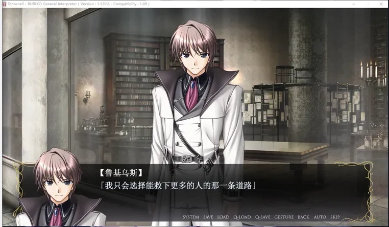
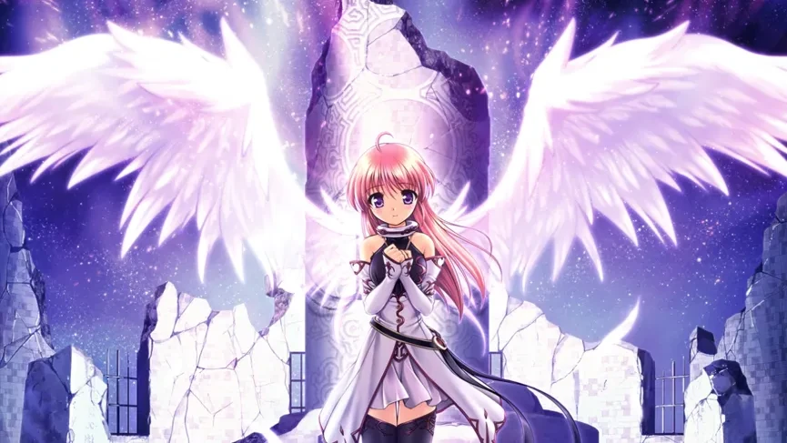

# 《秽翼的尤斯蒂娅》简评
> 原链接：[知乎回答](https://zhuanlan.zhihu.com/p/632816230)

《秽翼的尤斯蒂娅》是本人受到舍友推荐游玩的第一部八月社的作品。关于游戏的介绍，我再此就不赘述了，我简单谈一下个人游玩的一些体验和对他人评价的感想。

**请注意，以下内容含有剧透**

以下观点仅代表个人看法，如果和你的价值观出现冲突，那就是你对！

## 各人物支线剧情的问题

在游玩了真结局之后，回味各人物结局，会给我带来一种“苟延残喘”的感觉。小动物在真结局路线，面对天使寥寥几语的诱劝就能对凯伊姆产生如此强烈的占有欲，那么当他得知在其他路线上，凯伊姆（玩家）的选择之后，肯定会毅然决然选择让都市坠落吧（笑）。这样回过头去品味得到的感觉，让真结局显得弥足珍贵呢。

而最直观的游玩体验，便是我们的主人公凯伊姆桑前后不一致的割裂感。在我看来，凯伊姆在真结局之前，是对自己存在的意义这个问题，没有一个明确的答案的。他可能是对女人温柔的，但他绝对不会是沉浸在温柔乡里的人，他是自由的、同时也是空虚的和无目标的。如同在天空中漂浮的蒲公英，自由且无目的的随风飘拂。

总体来说，“脏翅膀”的支线和主线的关系，就好比树木的主干和枝桠。但我相信游玩到后期，枝桠的剧情并不能唤起玩家的共鸣。

有人因为支线剧情的敷衍批评作品，但我认为这不是八月社的本意，而是“脏翅膀”作为一个galgame美少女恋爱游戏来说，不得不有的一部分。作为一个galgame，他应该为玩家提供多个可以攻略的对象，并且提供满足不同XP的玩家的结局。而八月社，很明显是把重点放在了树木的主干之上，想要用更大的篇幅去完善整个故事。

## 主人公的心理历程

和广大玩家一样，我在游玩过程中，也有着 “这样就说服了吗” 的违和感，在菲奥奈和艾丽丝篇尤为严重。一方面原因可能因为玩的时候没有一字一句去分析，看的太快；另一方面可能就是剧本和人物的变化没有连接的很好。

但是就主人公凯伊姆的心理变化，我认为是描写的非常清晰的。随着凯伊姆的“阅历”增加，他的心理也在发生变化。有的人认为这是人物塑造得失败，尤其在高潮部分主人公的反复转变让许多玩家觉得无法理解他在想什么。其实在结尾，制作组给出了解释，那就是从故事开始就一直困扰凯伊姆的那句 “存在的意义” 。

凯伊姆因为大崩坏落入牢狱，受到牢狱的环境影响，认为自己就是牢狱的人。后来随着故事发展，他的活动范围在不断上升，而他因为 “逃避选择” ，所以自然而然把身边的环境和自己进行了绑定。这就是玩家在游玩中体会到的，“这个人怎么说话越来越像贵族一样” 的感觉，也就是主人公前后立场不一样的体现。

凯伊姆缺乏对人生的明确目标和自身存在意义的思考，所以受到身边的环境影响，而改变了自己的思考方式。理解了这一点，就很好理解他内心的纠结和最终做出的选择了。虽然说他最终最初的选择在我看来有一点儿女情长，但是你就说选没选嘛）

反观鲁基乌斯，在我游玩的时候，我感觉这个人就是卫宫切嗣的写照。在这种带有明显的功利主义的价值观的影响下，他做出了最符合人物设定的抉择。虽然这可能让玩家对他产生极大的厌恶，但是我却很难对他产生讨厌，因为他确实是向着自己坚信的存在意义不断前进的。

## 关于小动物

越是玩到后期，我对小动物越是不能直视。我可以明确的说，制作组绝对受到了基督教的影响，而小动物就是那个以耶稣基督为原型创造出来的救世主一样的人物。

因为家庭原因，我对基督教相关也有些许了解。所以当我看到小动物的使命 “就是去受尽苦难” ，当我看到原天使被囚禁在塔中的形态，很难不去联想到耶稣基督为了拯救世人而钉十字架，而 “耶稣受难” 也正是基督教的教义之一。

有人说结局是俗套的，小动物的这种 “讨好型人格” 很出戏之类，如果带入基督教的色彩去思考的话，那么整个故事的结局可以说是作者对自己想要表达的宗教观点的一个很好的说明。亦或者说，这个结局本该如此，因为在圣经里，耶稣也是这么做的。

作为圣子出生在马棚，代替罪孽深重的人类，去受十字架之苦，只为拯救世人，是不是和小动物的故事很像？你可能在之前觉得无法理解小动物的想法和行为，觉得她就是傻白甜天然善良，但我想告诉你，这不是制作组按照现在的天然女主作为模板设定出来的，而是按照耶稣的原型设计的角色，你会不会觉得对小动物的性格有了新的看法呢?

## 总结

《秽翼的尤斯蒂娅》可以说是制作组对基督教的一个很好的宣传或者说致敬。对于各位玩家来说，如果大家能够在游玩完游戏之后，愿意去了解基督教相关故事（了解即可，没有别的意思），它是一部能为你带来很多遐想的作品。而我本人游玩之后，也是希望其他玩家能够带着基督教的背景设定去重新思考故事，可能会给你带来不一样的体验。