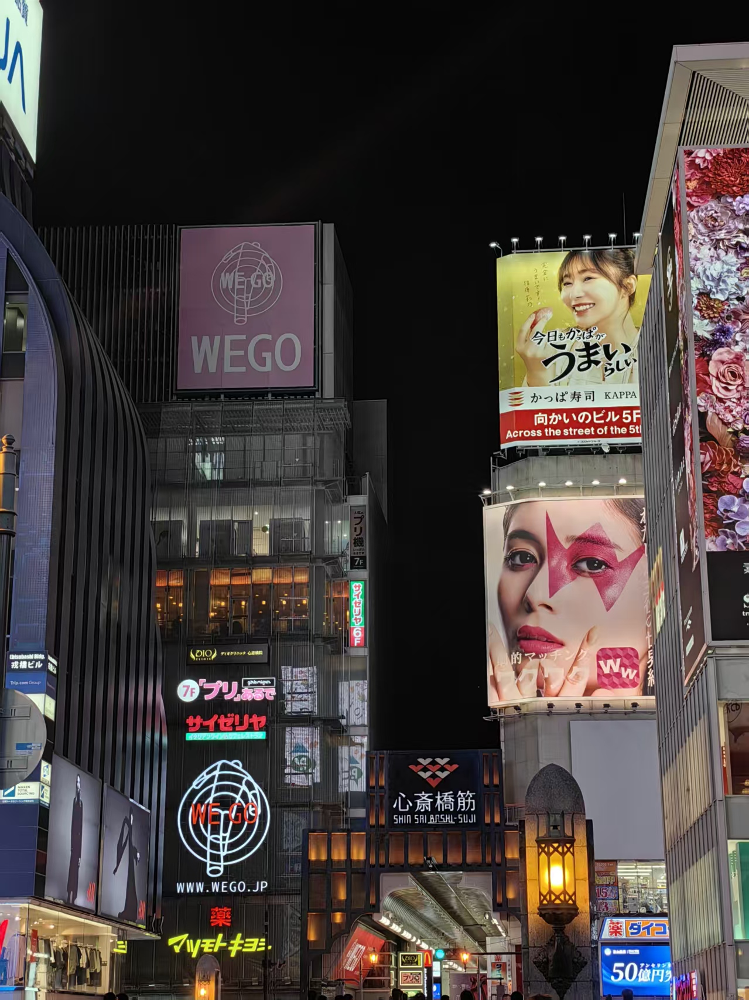
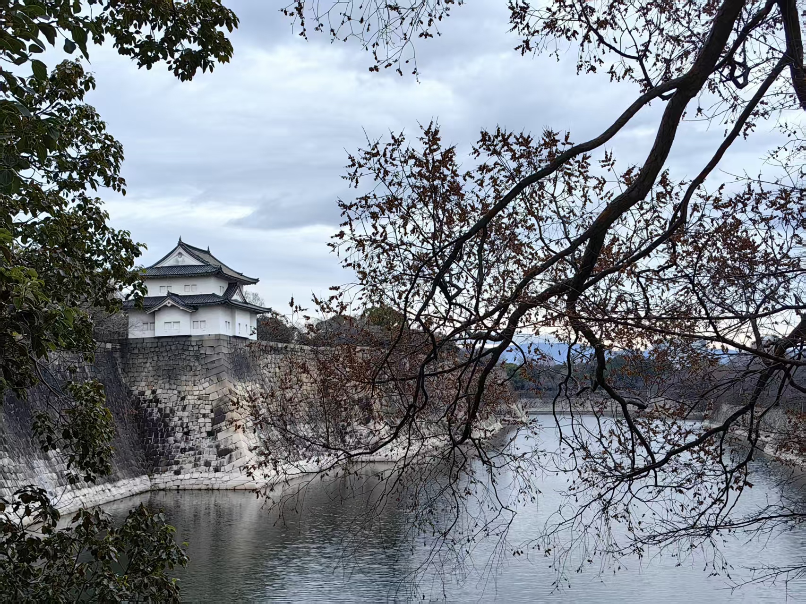

现在是 2025 年 10 月 27 日，我还困在杭州，接受为期两个月的出差折磨。

每到这种生活最艰难、情绪最糟的时候，我都会想起两年前，那个在计划第一次出国旅行的自己。
说出来可能很俗，但我一直觉得，一次旅行里最开心的时刻，往往发生在出发之前的那段筹划期。

时间拨回到 2023 年 11 月。
刚刚经历完残酷的保研，那种“总算活下来了”的虚脱感很快被另一种冲动取代：我突然很想在寒假出一次国。

这个想法来得非常突然，也可能并不突然。也许是从 9 月开始一路积压下来的压力，让我意识到，我的大学四年好像一直都在为“保研”服务。既然阶段性目标终于落地，是不是可以允许自己，真正地，休息一下？

本科那几年，说实话，疫情把我们困得很死，基本没什么旅游的机会。
我和朋友有一次在暑假飞成都，计划玩一周，结果刚落地成都就发现当地出现病例。我们第一天的第一件事不是吃火锅，而是去社区排队做核酸。那种体验，说真的，到现在都不太想回忆。

所以当疫情终于结束、保研也尘埃落定的时候，我感觉像是被突然放生了：我想出去走走，去一个完全不一样的地方，感受一种完全不属于我日常生活的节奏。

我立刻联系了朋友，开始准备护照，开始讨论去哪儿。

我其实一直有几个“如果有机会我一定想去”的目的地。
第一是美国西雅图。因为我初中的时候，DOTA2的TI就在西雅图举办。
第二个，就是日本。

我高中时被同学一把拉进了二次元的坑。日本对动漫爱好者来说不仅仅是“一个国家”，它是现实世界可以去的“圣地巡礼地图”。
所谓“圣地巡礼”，就是去动画里的取景地，站在和角色同一块楼梯、同一段铁轨边，去体验“我和角色真的在同一个时空里”的那种错觉。

《你的名字》里的楼梯，《吹响！上低音号》里的宇治市街景……这些地方在日本都是真实存在、真能走到眼前的。对我来说，这个诱惑实在是太大了。

更现实一点，日本的性价比也很高：从国内过去，机票价格在所有出国游里算便宜的。不是那种去欧美一张票几千上万，还得熬十几个小时航班的硬仗。淡季往返日本甚至不用 2000，飞行时间也就三小时左右。相比东南亚，日本整体治安更让人放心；相比新加坡、马来西亚，对我个人来说，日本的文化密度又不会显得无聊。

所以几乎没有太多犹豫，我就直接把板子拍死了：去日本。

一系列准备之后，2024 年 1 月 19 日，我们终于登上了飞往日本的航班。

整趟旅行，我们的路线是“阪进东出”，也就是：大阪入境，坐新干线一路玩到东京，再从东京回国。

这条路线是日本自由行非常经典的路线，基本可以一次性扫过日本大部分大家耳熟能详的城市和景点。
确实会有点走马观花，但对我们这些第一次踏上日本国土的人来说，这个行程几乎完美。
就算是走马观花，那也是骑着赤兔马去看上野的樱花。

当我们真正从关西机场走出来的时候，已经是下午四点多了。
折腾好了交通卡，我们直接上了去市中心的电车。

在那之前，我坐过的轨道交通基本只有国内的地铁——比如北京地铁。
所以第一次上日本的电车，我还是有点被惊到了。

日本的大部分轨道交通其实都跑在地上。一方面应该是因为地上修更省钱，另一方面也可能是很多地方地下空间并不宽裕。当然，在市中心区域还是有纯地下的地铁线路，只是相比国内那种“全城全是地下线”的印象，日本更多是“地上+地下”并行。

这次一共有四个人一起旅行。我们在住酒店还是住民宿这件事上犹豫了很久，最终还是选了民宿。

（后来回国后和别的朋友聊到这件事才发现，好像不是所有人都喜欢住民宿……）

我们当时的理由其实很朴素：一是便宜。同等地段，民宿人均价格确实能比酒店低不少。二是大家可以住在一起。晚上还能聊天吹牛，而不是像住酒店那样各回各屋，一个房间塞两个人，空间又小。

如果让我现在再选，我还是会倾向于民宿。原因甚至已经不是便宜，而是它更像是在真实地住进日本的日常。

从机场到我们住的地方，沿途可以很明显地感受到环境在变化：从郊外，到相对繁华的市区，再到最后那种有点像民居密集区的街区，甚至可以说带点平民窟味道的那种压迫感。

日本的轨道交通真的很夸张，夸张到像任意门。
你走出同一个地铁站的出口，眼前可能是最繁华的商圈，也可能是四下无人、安静到诡异的一片独栋住宅区。

街道普遍很窄，大多是单行道，四个人并排行走都会觉得别扭。
很多地方甚至没有严格意义上的人行道——行人和车就这么共用一条巷子。
房子和街道之间几乎没有退距，民宅一栋挨着一栋，像积木拼出来一样，没有我们习惯意义上的采光权、隐私距离这种浪漫说法。
头顶的高压线就像喝醉了的上班族，晃晃悠悠地在空中乱拧成一团。

我来之前其实刷过很多日本看房视频，但是真正站在巷子里，还是会被这种逼仄和密度震到。

等我们终于摸到民宿的时候，天已经黑了。
但所谓特种兵式旅游是没有休息的，于是我们放下行李就直奔心斋桥，顺便解决晚饭。

---

日本地铁的复杂程度，足够让第一次来的游客当场晕头转向。

我今年又再去了一次大阪，结果在难波附近换乘的时候还是一脸懵。
不同线路交织在一起，站厅分层、站中站、同名不同站台……你真的会怀疑自己是不是走进了什么迷宫副本。

那天我们实在搞不清楚了，决定逮个人问路。

正好迎面走来一位中年大叔。我们把他拦下来，刚准备用我们那点并不好用的日式寒暄开口，他直接打断：“别跟我在这儿私密马赛了，你说你要去哪？”

这一句把我们全笑疯了，场面一下子松了下来。后来问路也就特别顺。

---

日本的城市规划和国内是有明显差异的。

我有个学城乡规划的同学给我科普过：因为二战后日本很多城市几乎是从废墟里重建出来的，所以他们在战后重建时，得以把很多现代城市规划理念直接用上。最典型的，就是“以公共交通为核心来组织城市”的 TOD 模式。

TOD，全称是“以公共交通为导向的开发”（Transit-Oriented Development）。
它和美国、也和我们很多城市那种“以汽车为中心”的城市生长逻辑完全不同。TOD 的目标就是：让人尽量不需要开车。

简单说，一个住在东京的人，基本可以靠电车/地铁系统去到他日常想去的任何地方。

这种模式对第三产业特别友好。轨道交通本身就会吸引大量人流，在大站周围，商业被自然堆积和放大，于是“地铁站出口 = 直接进入商业区”就变成了常态。

对于普通乘客来说，进站刷卡之后你并不是直接进月台，而是会被带进一整套地下商业空间。吃饭、药妆店、日用品便利店、咖啡、甜品，甚至小型诊所，几乎全都在那一层里就可以搞定。

大型枢纽站之间甚至会用地下商业街彼此连成地下走廊，逛着逛着你已经从 A 商场走到了 B 百货，但全程还在室内。
而在居民区的小站，那个站本身几乎就兼任了“社区入口+小型购物中心”的角色——社畜下班从市中心坐车回来，出闸口前就已经把晚餐、日用品和第二天的便当都买好了，再抬脚回家，整个生活半径极小。

听上去真的很理想，对吧？那为什么我们国内并不常见？

其实是我们也在往这个方向走，但很多城市已经积重难返了。
我国的大城市早期更偏向学习美国式的摊大饼式扩张——地太大、路太宽、功能区分离明显，大家默认开车才是主流通勤方式。
这种模式一旦铺开，就很难再把商业、住宅、交通枢纽重新压到同一个点上，除非大拆大建。

比如北京，出门靠地铁当然行，但你很难将北京和步行者天堂联想到一起。

扯远了扯远了。反正，绕了一大圈，我们最后还是成功找到了心斋桥。

坦白说，心斋桥并没有我想象中那么繁华。
大阪整体给人的感觉也确实和东京不太一样：商圈是热闹的，但热闹有边界，往外一走，街景一下子就冷了。

如果要用廊坊的比喻，我会说心斋桥、难波、道顿堀这一带，就像是围绕万达广场的那个最核心的十字路口，灯牌密集、广告牌闪个不停，霓虹灯是那种上世纪九十年代录像带滤镜式的霓虹灯。离开这几条街的范围以后，气氛就明显沉下去了。

但对当时的我们来说，那一切都带着滤镜，就算它略显陈旧，也依然浪漫。

逛着逛着，我们饿到不行，完全没做攻略的四个人，直接在路边挑了一家大阪烧的小店推门进去了。现在回想，真的挺敢的。更幸运的是：我们竟然没被宰。

店里一个客人都没有，只有一个头发半白的老板在吧台后面收拾东西。
他先用日语打招呼，发现我们都是听不懂的表情后，就开始用手势和我们交流。这个时候你会发现：所谓“肢体语言才是世界语言”不是虚的。中国人说英语、日本人说英语，双方都可能听不懂，但是手势+表情+菜单指指点点，永远能搞定。

我们最后点了大阪烧和生啤的套餐，人均大概 1500 日元左右。现在回头看，这个价格在景区边上真的算不上狠宰了，而且还有酒喝，算良心。

唯一的槽点是：分量真的很少。
日本的定食分量偏小我们是早有耳闻，但第一次实际吃到的时候，还是会有一种“就这”的错愕。对我们来说，这一餐也就吃了个半饱，距离满足还有一段路。

不过这顿八嘎菜，算是正式宣布我们在日本的第一天结束了。

吃完出来的时候我们才发现，街上的很多店已经开始拉门打烊了。

这点和国内的商业街差异很大：无论是大商场还是小店，日本很多地方晚上八九点就基本结束营业。日本人的夜生活主要集中在居酒屋——下班喝酒，再喝酒，继续喝酒。
这让我们当时非常不适应：我们还想逛逛夜市的，结果街上已经冷冷清清了。只能扫兴撤退，准备回民宿。

---

我们的民宿在岸里玉出站附近。这个车站非常朴素，甚至可以说有点寒酸。

像岸里玉出这样的车站，在日本是主流形态：地面站台，一条轨道，简单的棚子挡雨，站台和铁轨之间几乎没有防护，站在边缘会本能地觉得我是不是离死亡只差半步。

回民宿之前，我们顺路进了附近的超市。本来只是想买点水，结果直接震撼。

我个人觉得：去日本旅游，必须安排的一个环节，是便利店/超市夜间采购环节。而且这个采购的重点不是奢侈品，是零食和酒。

国内便利店的零食和饮料，说实话，现在同质化挺严重的。
可在日本，你会第一次意识到：

原来货架上的饮料口味可以丰富成这样。

原来低度酒可以细分成这么多品类。

原来便当这种东西，在晚上八点半之后，会统一被贴上打折贴纸，然后疯狂降价清仓。

我们第一天晚上就发现了这件事，当场疯狂扫货，买了一堆酒和零食带回民宿。从那以后我们彻底上瘾：每天白天观光打卡，晚上回去就开局小聚会，喝到开心为止。几乎变成了我们这趟旅行的固定节目。

在这种节奏里，我们的日本之旅正式开始了。

---

第二天的行程安排得很轻松：通天阁和大阪城。

这两个地方可以说是大阪的经典打卡点。
通天阁号称“大阪之塔”，据说是仿照东京晴空塔那一类的现代观景塔建的（虽然高度完全不是一个量级，后面也听说已经被梅田那边的新地标超过去了）。
大阪城则是市中心最具代表性的历史景点之一，虽然现在的天守本体其实是重建过的。

通天阁是可以购票上塔参观的。我们第一次来当然老老实实买了票，一路坐电梯到顶层观景区。
塔顶可以 360 度环视大阪城区，如果再加钱，可以上到最顶层的露天平台。

说实话，整体观景体验还是挺新鲜的，但如果你以后还打算去东京登晴空塔，那我会建议：通天阁远观留照就好，钱包可以先收着（笑）。

大阪城就不一样了，我个人会更推荐。

大阪城整块区域被护城河包围，形成了一个大阪城公园。公园里除了大阪城本体，还有一些现代建筑，比如剑道馆、酒店、游客中心之类的设施。沿路能看到一拨拨中学生在集体活动，那个画面充满了日常的感觉。

如果你是《名侦探柯南》党，尤其是服部平次粉丝，那你应该立刻能认出来某几个视角。现实里的取景点和动画里的分镜几乎一模一样，圣地巡礼爱好者真的会爽到。

大阪城的内部，其实就是一座历史博物馆。
买票进城之后，城体的各个楼层会依次展示幕府相关的历史、丰臣秀吉时代的背景、战事复原，还有各类文物复制/保存展陈。我记得其中某一层还能穿上盔甲拍照，现场有几个欧洲佬玩得特别投入。

整个参观体验对游客是比较友好的：展板有英文，也有中文说明（至少当时我记得是有的），所以不太会出现那种只能看热闹的尴尬。

总的来说，我们第二天行程其实挺松弛的，主要也就逛了通天阁和大阪城。
现在回想起来还有点遗憾：第一次来竟然没有顺路去日本桥逛一逛二次元圣地，实在可惜。按理说那可是我们的主战场。

而且如果让我给第一次“阪进东出”的人一点建议，我会说：落地大阪之后，最关键的其实不是在大阪玩，而是一定要去京都。

京都作为历史古城，景点密度和文化厚度都远高于大阪，有一种穿越回唐朝的奇幻感。奈良也类似，它不是“到此一游”的城市，它更像是“你得慢慢走路、慢慢听故事”的城市。

但这就引出了我们当时最大的焦虑：
对于这些带有厚重历史感的地方来说，光是你自己去看看建筑、拍拍照，其实是远远不够的。

我当时就特别想找一个本地导游，最好是能边走边讲那种，把建筑、历史、典故串起来。
在国内景点我们很习惯有讲解员，甚至还能蹭一下旅行团导游。但我当时完全不确定日本是不是也有这种东西。

结果还真有。

在出发前，我在日本旅游的官方网站上发现了一个“志愿者导游”栏目。这个项目的形式大概是这样：各地的自治团体可以自发组织自己的志愿导游小组，把信息报上去，由官方统一挂在页面上，方便游客联系。

因为我们的行程当中包含了京都、奈良和后面的镰仓这几个历史城市，所以我定下的策略是：大阪段找一个导游，东京段再找一个导游。
我当时基本是“海投邮件”，给好几个志愿团体都发了需求邮件。

最后，大阪这边我们联系上了一个叫中岛的导游，他说可以带我们逛京都和奈良。
东京那边我们也约到了另一个导游（很不好意思，我现在真的想不起来他的名字了），准备带我们逛镰仓。

大阪这边的行程是我们和中岛一起讨论敲定的。
因为他们是志愿者性质的导览，所以我们不需要额外付导游费，只需要承担他们当天的交通费和餐费。
而且中岛会中文和英文，按理说我们整个行程可以用中文交流，必要的时候用一点英文补充。

说实话，前一晚我真的挺激动，也有点紧张。
这是我第一次真正意义上和一个日本人接触。

第三天一早，我们按约定的时间到了地铁站门口。
远远地就看到一个收拾得很利落的老头，戴着针织帽，站在出口附近，一边环顾一边等人。

我们走上去，他主动迎了过来：

“啊，是安先生吗？”
“是的。”
“我是中岛，很高兴见到你！”

他用中文做了自我介绍，还和我们一一握手。

说真的，我第一眼是有点惊到的，因为他看起来年纪真的不小了。
后来路上聊天才知道，他已经七十多岁了。退休之后来做志愿者导游，是想让自己的生活更有趣一点。年轻的时候他是大阪大学的学生，读政治学，还是 70 年代的大学生；改革开放初期他去过中国，也去过北京王府井。现在他主要靠广播节目和书本慢慢学中文。

他的中文并不算特别流利，有些词要想一下，但我们四个都特别敬佩他：七十多岁了，还在认真学一种新的语言，然后用它带陌生人看他的城市。

那一刻开始，我对“旅行”这两个字的理解，发生了第一次真实的位移。

---

To be continued...