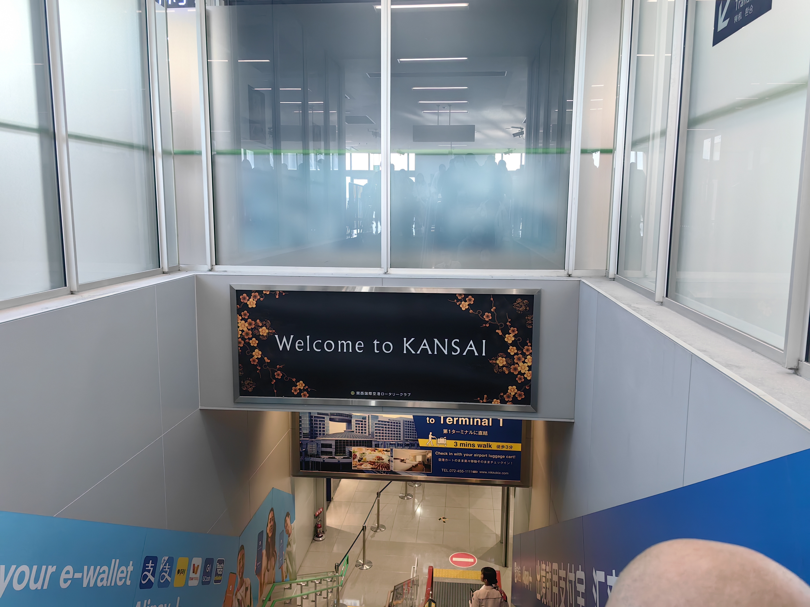

现在是2025年的10月27日，我还在杭州接受为期两个月的出差煎熬。
每次在这种艰难的生活节点，我就会回想起两年前，在计划着第一次出国的自己。
一次旅行，最开心的时候也许就是在出发前计划它的时候。

在2023年的11月份，经历完残酷的保研，我突然想在寒假出国旅游一次。
当这个想法来的很突然，也许是9月份的压抑让我感觉到，好像自己的大学四年好像一直在为保研而努力，而现在是时候休息一下了。
本科的时候，因为疫情，我们连外出旅游的机会都很少。我曾经和朋友们去在暑假去成都玩了一周，但是一落地就发现成都出现了病例。所以我们在落地的当天，甚至都要去社区排队做核酸，真的是很不想回忆起来的体验了。
现如今，疫情结束，保研尘埃落定，是时候去放松一下，体验不同的风土人情。

于是我立刻联系了朋友们，提前准备好护照，看一看去哪个国家。
我其实一直有几个出国的梦想目的地。
一个是美国西雅图，因为在我初中的时候，dota2的TI就是在西雅图举办，给当时小小的我留下了深刻的印象。
其次就是日本了。
在高中的时候，我被高中同学带入了动漫的坑中。
看过动漫的同学都知道，日本对于动漫爱好者来说，是圣地巡礼的天堂。
所谓圣地巡礼，其实就是去动漫的取景地，感受一下这种跨越次元壁，与动漫人物同处于同一个时空的感觉。
无论是《你的名字》中的楼梯，还是《京吹》里的宇治市，等等场景都可以在日本亲自前往，这对我来说，吸引力实在是太大了。
再加上日本应该是在整个出国旅游的选择里，性价比最高的。来回机票不是很贵，与欧洲美国动辄几千上万，加上十几个小时的超长航班相比，淡季来回机票只需要不到2000，总飞行时长只需要3个小时的日本真的是性价比很高的选择。并且和东南亚相比，日本要安全得多；和新加坡马来西亚相比，又不会显得很无聊。
我几乎是立刻拍定了板子，去日本。
经过了一系列的准备，最终我们在24年的1月19日，登上了前往日本的航班。

我们的整体旅行计划是阪进东出，也就是落地大阪，然后做新干线前往东京，最后从东京回国。
这是很经典的，一次性逛完日本绝大部分景点的路线了。
虽然整体会显得有点走马观花，但是对于第一次去日本的我们，这绝对是很充实的旅行计划了！
即使是走马观花，也是骑着赤兔马观上野樱花。

等到我们真正从关西机场出来的时候，已经是下午四点多了。
好不容易折腾好了交通卡，我们直接踏上了前往市中心的电车。
在这之前，我只在北京坐过轨道交通，也就是北京的地铁。
所以第一次做日本的电车，我还是被“惊艳”到了。

因为日本其实绝大部分的电车是在地上的，一方面是这样的建设成本很低，一方面是地下应该是没有什么空间。
当然在市中心的部分地下铁都是在地下的，只是说相对国内而言，他们会有更多的电车在地上运行。

我们这次一共有四个人来日本，我们在酒店和民宿中犹豫了很久，最终选择了民宿。
（后面在和其他来日本玩过的朋友聊天的时候才发现，好像不是所有人都喜欢住民宿）
我们当时选择民宿的原因，其实很朴素，就是因为民宿平摊下来的价格比酒店要便宜很多。
另外民宿大家可以住在一起，晚上可以聊天，而酒店只能分开住，空间也相对狭小。

其实让我现在选择，我觉得住民宿是更能够感受真实日本风土人情的选择。
从机场一路到民宿，我们其实能够明显感觉到从郊区前往市中心，最后到达平民窟的变化过程。
日本的轨道交通真的很发达，发达到就像是任意门一样。
出了地铁站，迎接你的可能是最繁华的市中心，也可能是四下无人，一片死寂的独栋住宅。
狭窄的街道，一般都是单行道，连四个人并排通过都成了难事。
因为没有人行道，所以大多数时候人是和车并排，共享马路的。
民宅紧挨着街道，一栋一栋和拼好的积木一样搭在一起，没有所谓的采光、隐私可言。
头顶的高压线就像喝醉了酒的上班族一样，随意交织在一起。
虽然我来之前看过很多日本的看房视频，但是亲自来了之后还是被这种闭塞给震撼到了。

到民宿的时候，已经是晚上了。
特种兵旅游是没有休息的，所以我们放下行李直奔心斋桥，顺便找饭吃。

但是第一次来日本，这个地铁的复杂程度确实是把我们搞晕了。
即使是今年，我再一次去大阪，一上来还是没有搞明白在难波的一系列地铁线路是怎么换乘的。
我们晕晕乎乎坐到了站，我没记错的话应该是心斋桥。
好不容易出了地铁站，

To be continued...

